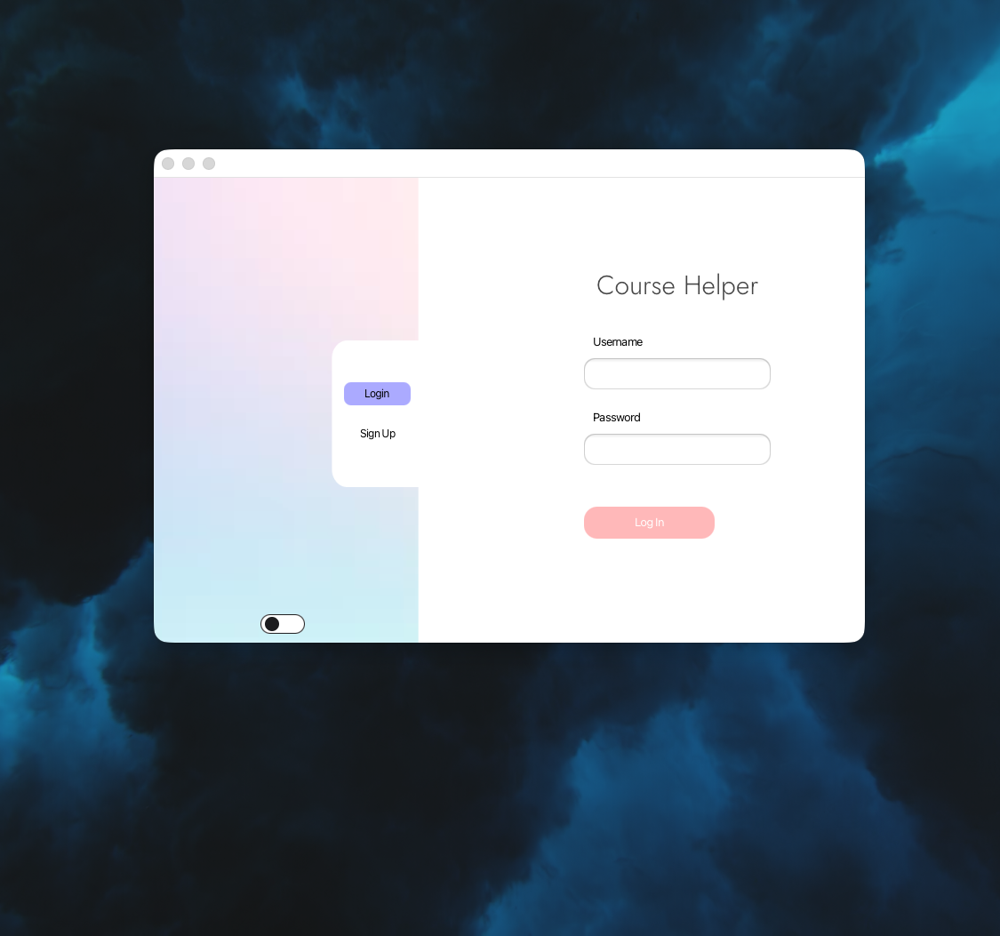
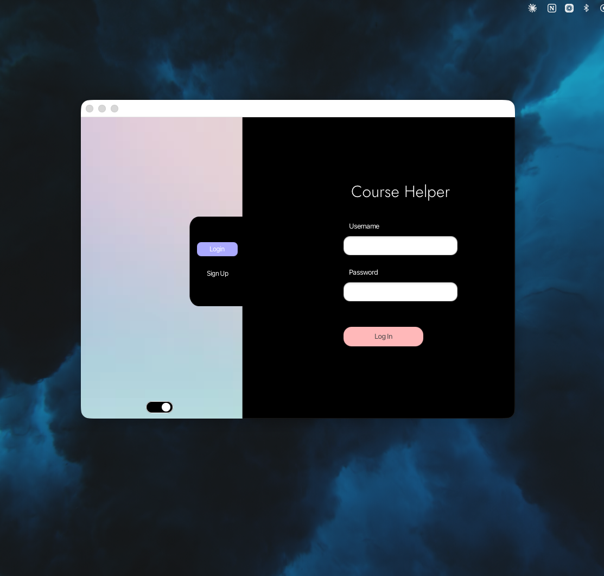
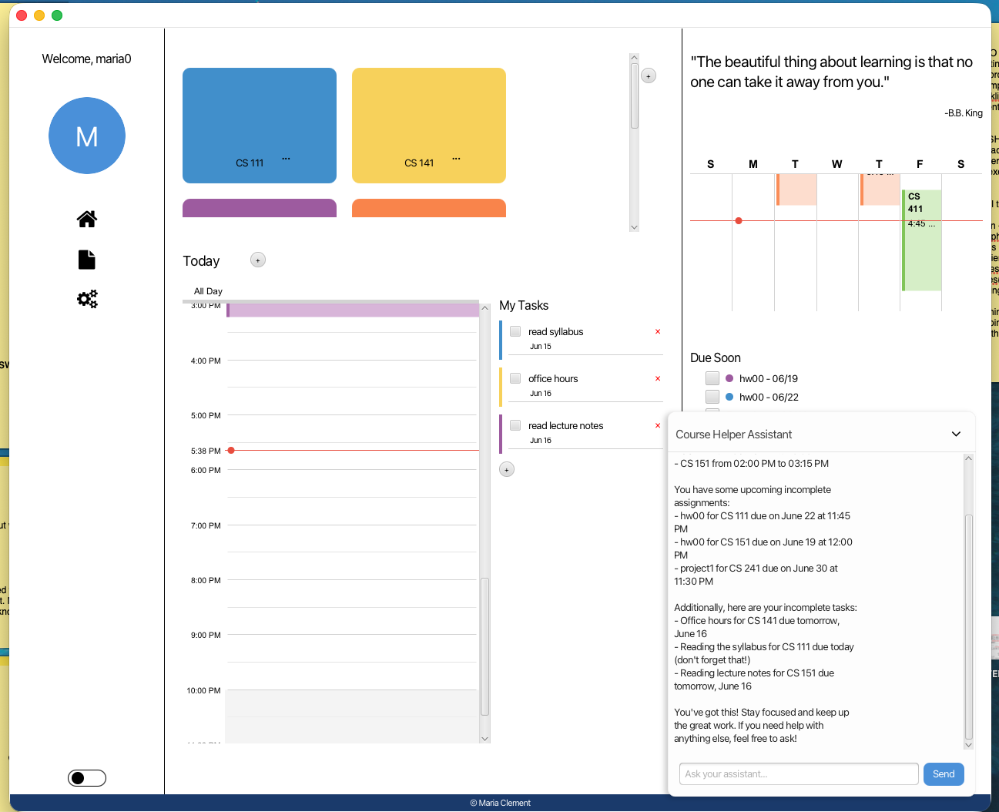
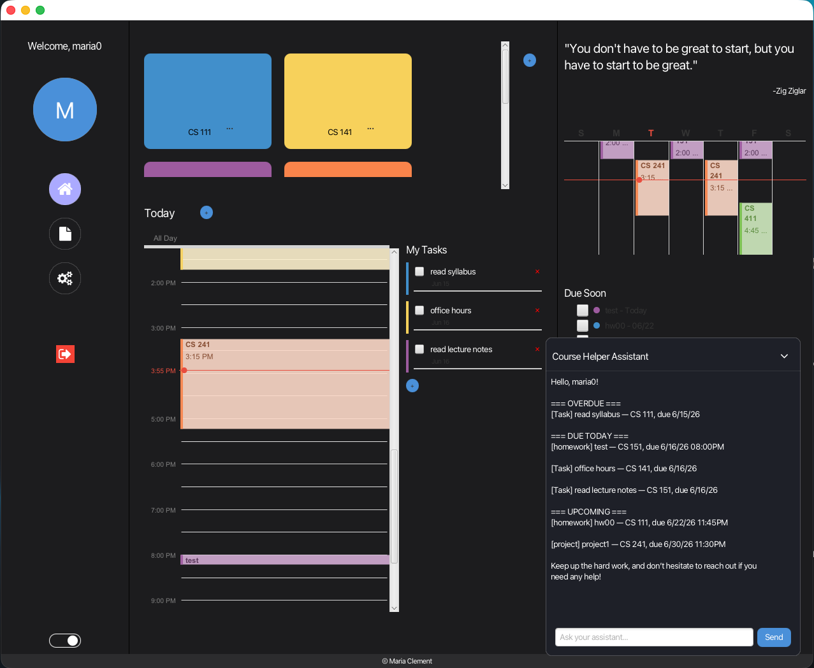
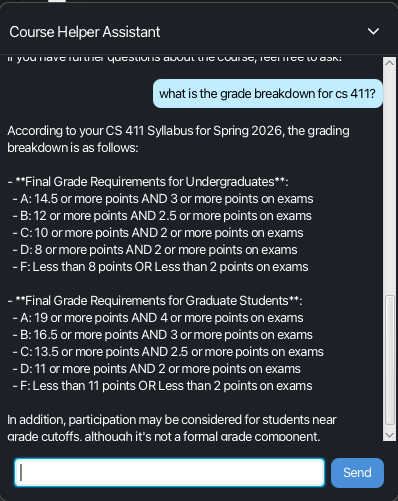
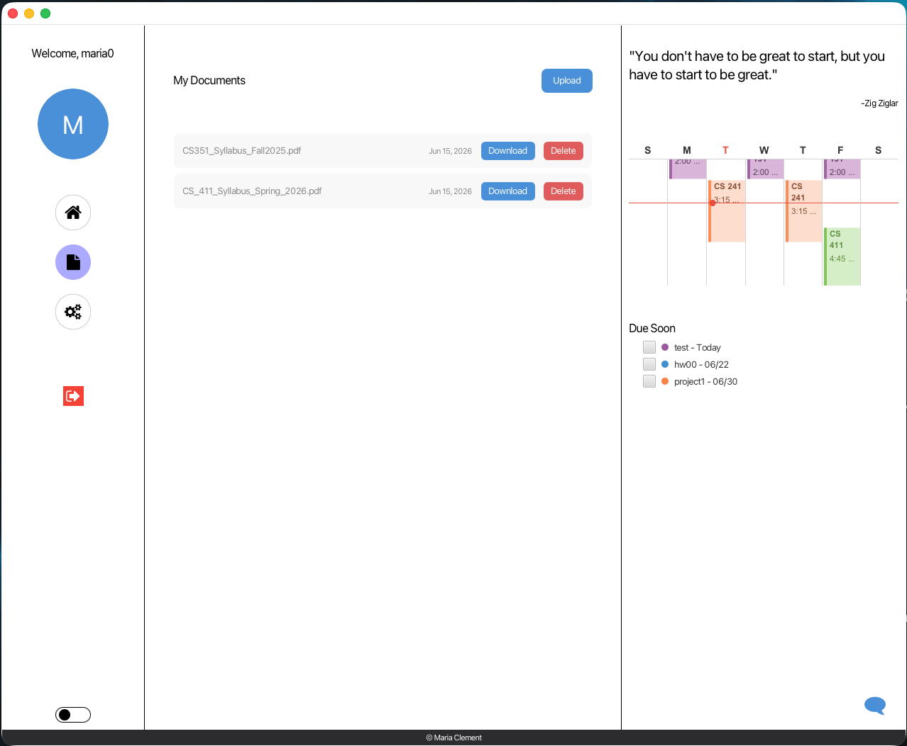
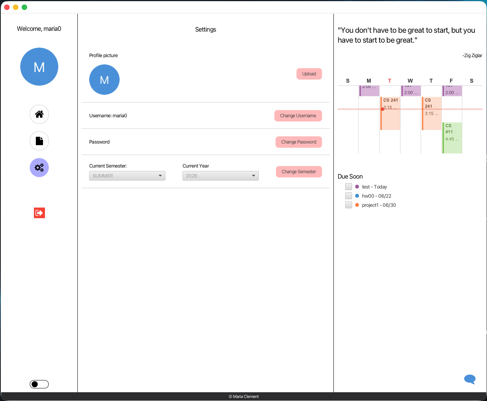

# CourseHelper

A full-stack Java desktop application that centralizes course resources, schedules, assignments, and tasks for students with an AI-powered assistant that can answer questions about uploaded documents and students' schedules. 

Developed by Maria Clement. Designed by Crystal Zelinske.

---

## Screenshots

| Light Mode | Dark Mode |
|---|---|
|  |  |
|  |  |

**AI Chat**



**Document Upload**



**Settings**



---

## Features

- JWT-secured authentication (register, login, logout)
- Course management with color-coded calendar events
- Assignment and task tracking with due date classification
- CalendarFX integration with recurring event support
- PDF document upload with semantic search via pgvector
- AI assistant with agentic tool-calling loop (GPT-4o)
- Light / dark theme with live toggle and persistent preference

---

## Tech Stack

| Layer | Technology |
|---|---|
| Frontend | JavaFX 17, CalendarFX, Maven |
| Backend | Spring Boot 4, Java 17, Maven |
| Database | PostgreSQL + pgvector |
| AI | OpenAI GPT-4o (chat + embeddings) |
| Auth | JWT (jjwt) |

---

## Architecture

### Backend — Feature-based Modularization

The backend is organized by domain, each as a self-contained package:

```
backend/
└── src/main/java/com/coursehelper/backend/
    ├── auth/          # JWT filter, login, registration
    ├── user/          # User entity, profile, username/password change
    ├── course/        # Course CRUD
    ├── assignment/    # Assignment tracking
    ├── task/          # Task tracking
    ├── event/         # Calendar events
    ├── userSettings/  # Semester configuration
    ├── ai/            # Agent, RAG pipeline, tool definitions
    └── exceptions/    # Global exception handler
```

Each domain exposes a REST controller, delegates to a service, and uses a Spring Data JPA repository. No domain leaks into another's layer.

### Exception Handling

A single `GlobalExceptionHandler` maps domain exceptions (`ResourceNotFoundException`, `UsernameAlreadyExistsException`, `InvalidCredentialsException`, `FileProcessingException`, `AIServiceException`) to consistent HTTP responses. Controllers throw; the handler catches.

### RAG Pipeline

1. User uploads a PDF via `DocumentController`
2. `IngestionService` extracts text (Apache PDFBox), splits into overlapping chunks (`TextChunker`), embeds each chunk via OpenAI (`EmbeddingService`), and stores vectors in PostgreSQL with pgvector
3. On query, `ResourceRetrievalTool` runs a cosine similarity search and returns the top-matching chunks

### AI Agentic Loop

`AgentService` runs a multi-turn loop with GPT-4o and five tools:

| Tool | Purpose |
|---|---|
| `search_resources` | Semantic search over uploaded documents |
| `get_schedule` | Retrieve course schedule for the semester |
| `get_assignments` | Fetch assignments filtered by status |
| `get_tasks` | Fetch tasks filtered by completion |
| `get_summary` | Combined overdue / due-today / upcoming summary |

The loop continues until GPT-4o returns `finish_reason: stop`. Tools do all data classification server-side — the model only formats and presents.

### Frontend — Theme System

`ThemeManager` maintains a `LightMode/` and `DarkMode/` stylesheet folder. Calling `ThemeManager.setTheme(root, theme)` swaps all stylesheets on the root node; child pages inherit via CSS cascade. Preference is persisted to `~/.coursehelper/theme.txt`.

---

## Setup

### Prerequisites

- Java 17
- Maven
- PostgreSQL with the `pgvector` extension
- An OpenAI API key

### Database

```sql
CREATE DATABASE course_helper;
CREATE USER course_helper_user WITH PASSWORD 'your-password';
GRANT ALL PRIVILEGES ON DATABASE course_helper TO course_helper_user;
\c course_helper
CREATE EXTENSION IF NOT EXISTS vector;
```

Create the schema manually — JPA DDL is set to `none`.

### Environment Variables

The backend reads credentials from environment variables. Set the following before running:

```bash
export DB_URL=jdbc:postgresql://localhost:5432/course_helper
export DB_USERNAME=course_helper_user
export DB_PASSWORD=your-db-password
export OPENAI_API_KEY=your-openai-api-key
export JWT_SECRET=your-jwt-secret-min-32-chars
```

### Run

```bash
# Terminal 1 — start the backend
cd backend && ./mvnw spring-boot:run

# Terminal 2 — start the frontend (requires backend running)
cd frontend && mvn javafx:run
```

---

## Project Structure

```
course-helper/
├── backend/    # Spring Boot REST API
├── frontend/   # JavaFX desktop client
└── assests/    # Screenshots
```

The two modules are independent Maven projects. The frontend communicates with the backend at `http://localhost:8080/api`.
